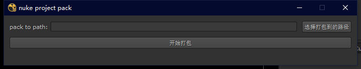
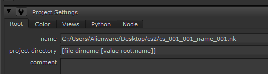
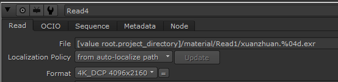

# nuke_project_pack
## 一个简单的nuke工程打包工具

## 安装方法

把 nuke_project_pack.py 文件和 menu.py 文件放到nuke的 .nuke 文件夹，如果你的.nuke文件夹已经有了 menu.py 文件，把下载的 menu.py 文件里的代码复制出来粘贴到你目录里的 menu.py 里。

## 使用方法

打开nuke后上边菜单栏会有 打包工程 的选项，点击这个选项，然后在弹出的对话框中输入工程文件和素材文件要打包到哪个文件夹，然后点 开始打包

这个脚本会把用到的素材和工程文件复制到指定的文件夹，然后替换素材路径为相对路径

